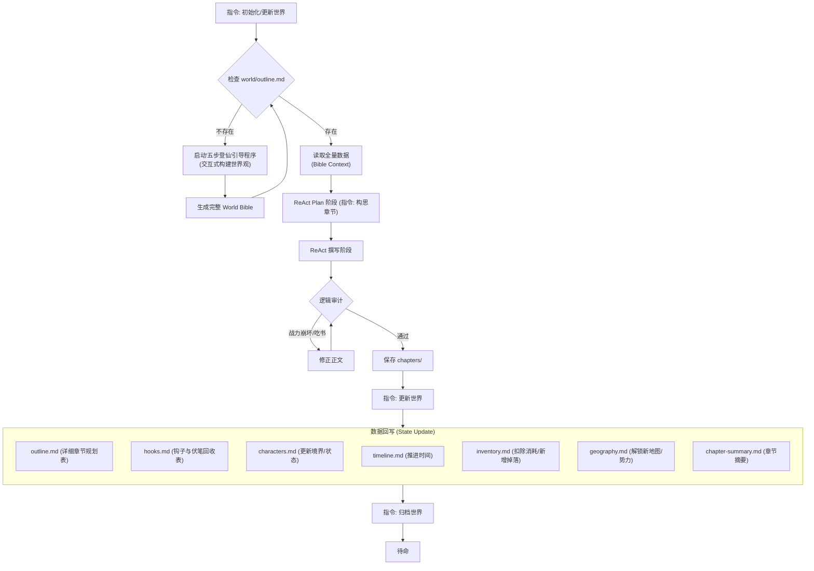

# Novel Assistant 项目概览

## 项目简介

Novel Assistant 是一个用于辅助创作中文玄幻小说的结构化世界观数据库管理项目。项目旨在通过结构化的数据文件（World Bible）来维护长篇玄幻小说的剧情、人物、时间线、道具和地理信息，确保长篇作品的世界观一致性和逻辑连贯性。

## 项目结构

```
novel-assistant/
├── world/                    # 世界观数据目录（核心）
│   ├── archive/              # 归档数据目录
│   │   ├── outline_history.md      # 剧情大纲历史存档
│   │   ├── characters_registry.md # 死亡/离场人物登记簿
│   │   ├── timeline_chronicles.md  # 历史时间线长卷
│   │   ├── inventory_logs.md       # 道具消耗/损毁记录
│   │   └── world_atlas.md          # 旧地图/已探索区域志
│   ├── outline.md            # 剧情大纲
│   ├── characters.md       # 人物档案
│   ├── timeline.md           # 时间线管理
│   ├── geography.md          # 地理与势力
│   ├── inventory.md          # 道具与功法
│   └── power.md              # 力量体系
├── chapters/                 # 正文章节txt文件目录
├── analysis/                 # 分析报告
│   └── trending-analysis.md  # 长篇小说题材深度分析
├── metadata/                 # 项目元数据 (如 novel-metadata.md)
├── writespec/                # 写作规范
│   ├── archiving-spec.md     # 归档规范
│   ├── style-guide.md        # 写作风格指南
│   └── chapter-creation-spec.md  # 章节构思&撰写规范
├── skills/                   # AI Skills
├── templates/                # 模板目录
│   ├── outline-template.md         # 剧情大纲模板
│   ├── characters-template.md      # 人物档案模板
│   ├── timeline-template.md        # 时间线模板
│   ├── hooks-template.md           # 钩子与伏笔回收表模板
│   ├── geography-template.md       # 地图势力模板
│   ├── inventory-template.md       # 道具模板
│   ├── chapter-summary-template.md # 章节摘要模板
│   └── power-system-template.md    # 力量体系模板
├── AGENTS.md                 # 本文件 (指令集与工作流)
└── README.md                 # 项目基础说明
```

## World Bible 核心工作流程

系统严格依赖 `outline.md` 作为世界观种子的来源，遵循 **"大纲驱动 (Outline-Driven)"** 的创作闭环。


```mermaid
flowchart TD
    Start["指令: 初始化/更新世界"] --> CheckOutline{"检查 world/outline.md"}

    CheckOutline -->|"不存在"| Genesis["启动'五步登仙'引导程序\n(交互式构建世界观)"]
    Genesis --> GenerateBible["生成完整 World Bible"]
    GenerateBible --> CheckOutline

    CheckOutline -->|"存在"| Read["读取全量数据\n(Bible Context)"]

    Read --> Plan["ReAct Plan 阶段 (指令: 构思章节)"]
    Plan --> Draft["ReAct 撰写阶段"]
    Draft --> Verify{"逻辑审计"}
    
    Verify -->|"战力崩坏/吃书"| Fix["修正正文"]
    Fix --> Verify
    
    Verify -->|"通过"| Publish["保存 chapters/"]
    Publish --> Update["指令: 更新世界"]
    
    subgraph UpdateBible ["数据回写 (State Update)"]
        direction TB
        U1["outline.md (详细章节规划表)"]
        U2["hooks.md (钩子与伏笔回收表)"]
        U3["characters.md (更新境界/状态)"]
        U4["timeline.md (推进时间)"]
        U5["inventory.md (扣除消耗/新增掉落)"]
        U6["geography.md (解锁新地图/势力)"]
        U7["chapter-summary.md (章节摘要)"]
    end
    
    Update --> UpdateBible
    UpdateBible --> Archive["指令: 归档世界"]
    Archive --> Finish["待命"]
```

## 初始化策略：五步登仙·模组化引导法

当检测到 `world/outline.md` 缺失时，AI 不应简单询问“你想写什么”，而是化身**金牌编辑**，启动 **Five-Step Genesis Protocol**，通过五个核心维度的选择题引导用户构建神作基石。

**交互原则**：使用网文行话（黑话），提供“多选+自定义”模式，激发用户灵感。

1.  **Step 1: 定流派 (The Archetype)**
    *   询问核心爽点。选项包括：[A]凡人流（资源管理）、[B]无敌流（碾压）、[C]系统签到流（快节奏）、[D]苟道流（反套路）、[E]克系/诡道流（氛围）。
2.  **Step 2: 铸金手指 (The Golden Finger)**
    *   确立主角的不公平优势。选项包括：[A]随身老爷爷、[B]神秘小绿瓶、[C]熟练度面板、[D]特殊血脉/体质、[E]重生/轮回知晓未来。
3.  **Step 3: 黄金三章开局 (The Opening Hook)**
    *   设定初始冲突，确立第一卷动力。选项包括：[A]退婚羞辱、[B]灭门逃杀、[C]宗门废柴被逐、[D]夺舍反派、[E]扮猪吃虎。
4.  **Step 4: 世界观架构 (The World Scale)**
    *   决定地图规模。选项包括：[A]传统层层飞升、[B]诸天万界副本流、[C]黑暗森林猎杀场、[D]唯一大世界。
5.  **Step 5: 情感与结局 (Tone & Romance)**
    *   决定配角策略。选项包括：[A]单女主（纯爱）、[B]多女主（后宫）、[C]无CP（大道独行）、[D]暧昧拉扯、[E]热血兄弟情。

**生成逻辑**：
当用户完成 1-5 步的选择后，AI 不应立刻生成平铺直叙的大纲，而是要**展现思考过程（ReAct）**，进行化学反应分析：

**AI 内部运行逻辑示例：**
> **[Observation]** 用户选择了：1-[A]凡人流 + 2-[C]熟练度面板 + 3-[B]灭门逃杀 + 4-[C]黑暗森林猎杀场 + 5-[C]无CP大道独行。
> **[Thought]** 
> *   分析化学反应：凡人流+熟练度=**肝帝**；黑暗废土+地狱开局=**极度压抑的生存危机**；无CP=**极致理智与冷酷**。
> *   核心看点：主角在一个人吃人、灵气有毒的绝望世界中，凭借一块没有感情的熟练度面板，抛弃一切道德与情感，为了活下去疯狂磨炼技艺，最终从底层杀穿黑暗森林。
> *   定调：**极致暗黑向、冷酷极道苟活流**。
> **[Action]** 一份逻辑自洽、卖点清晰的 `outline.md`。

## 核心指令集 (Key Commands)

#### 1. "初始化世界" (Initialize World)
**功能**: 从零构建世界观。
- **执行流程**:
  1. 扫描 `world/` 目录。
  2. 若 `outline.md` 缺失，立即执行 **五步登仙引导法** 与用户对话。
  3. 获得核心设定后，AI 提示：“天道法则已确立，正在演化世界...”。
  4. 读取`templates/`目录下模板,自动生成 `outline.md`，并提取关键信息填充 `characters.md` (人物档案), `power.md` (力量体系), `geography.md` (地图与势力),`hooks.md` (钩子与伏笔回收表)。
  5. 反馈：`[系统] World Bible 初始化完成。当前主角：[姓名]，境界：[初始境界]。`

#### 2. "更新世界"(Update World)
分析最近生成的正文，同步更新所有 World Bible 文件。
- **功能**: 触发全量文档审查与更新。
- **执行流程**:
    1. **更新 `world/characters.md`**:
        - 添加新出现的人物档案、功法技能、天赋属性、人际关系变化或状态更新。
    2. **更新 `world/inventory.md`**:
        - 记录新获得的装备与法宝、消耗品与材料、功法/武技、情报与地图。
        - 移除本章已消耗的丹药、符箓等一次性物品、已损毁的装备和法宝等。
    3. **更新 `world/timeline.md` 与 `world/power.md`**:
        - 记录本章发生的重大事件时间节点（闭关时间、赶路时间等）。
        - 若有境界突破或战力体系扩展，同步更新 `power.md`。
    4. **更新 `world/hooks.md`**:
        - 记录新的核心钩子、伏笔埋设、情绪爆发点。
        - 回收钩子标记为“✅ 已回收”
    5. **更新 `world/chapter-summary.md`**:
        - 记录每一章节的摘要
    6. **更新 `world/outline.md`**:
        - 标记当前情节点为“✅ 已完成”。
        - 更新 **字数规划** 中的当前总字数。
        - 检查**详细章节规划表**，若后续待创作章节不存在或不足，自动补充 1-3 个待创作章节标题（字数随机 2-8 字）。
- **触发时机**:
  - 每写完一个完整情节或章节后。
  - 发现新的世界观设定或模式时。
  - 用户显式要求更新时。
  
#### 3. "归档世界" (Archive World)
**功能**: 强制扫描并清理 `world/` 目录，生成归档索引。
- **执行流程**:
  1. 扫描 `world/` 下的所有活跃文件。
  2. 按照[archiving-spec.md](references/archiving-spec.md)规则识别已完成的剧情卷、死亡/离场人物、已消耗道具、已离开的旧地图。
  3. 将冗余数据迁移至 `world/archive/` 对应文件。
  4. 在活跃文件中保留归档索引链接。

#### 4. "查看世界状态" (Check World Status)
**功能**: 快速状态查询。
- **输出**: 返回当前时间点、主角所在地、当前状态（HP/MP/Buff）、最近的主线任务目标。

#### 5. "构思章节" (Draft Chapter)
**功能**: 启动单章创作的标准 ReAct 工作流。
- **执行流程**:
  1. **初始化 (Init)**: 确认目标章节号。
  2. **任务规划 (Phase: TODO)**: 
  在进入任何具体创作步骤前，AI 必须首先输出一个 `[TODO]` 列表，明确本次任务的子步骤。
    - 严格遵循 **[chapter-creation-spec.md](writespec/chapter-creation-spec.md)** 中的任务清单。
  3. **构思阶段 (Phase 1: Plan)**: 
    - **执行标准**：读取规范 **[chapter-creation-spec.md](writespec/chapter-creation-spec.md)** 中的 Phase 1 阶段要求。
    - **核心逻辑**：检索 World Bible -> 确认主线与状态 -> 输出场景细纲 -> 逻辑审计。
    - **输出要求**：必须显式输出 `Thought`（推演）、`Action`（细纲）和 `Observation`（审计结果）。
    - **自动流转**：Phase 1 结束后，自动选择推荐的剧情分支，无缝衔接进入 Phase 2。
  4. **撰写阶段 (Phase 2: Draft)**:
    - **执行标准**：自动选择推荐分支后，继续执行 **[chapter-creation-spec.md](writespec/chapter-creation-spec.md)** 中的 Phase 2 阶段要求。
    - **核心逻辑**：设定感官锚点 -> 确认生理限制 -> 执行正文撰写 -> 质量审计。
    - **输出要求**：必须统一输出至 `chapters/` 目录，并显式进行去 AI 味审计与数据变更预告。 
  5. **收尾 (Finish)**: 自动执行 "更新世界" 指令，同步更新所有 World Bible 文件。
  6. **归档 (Archive)**: 执行 "归档世界" 指令，扫描并清理 `world/` 目录下的冗余数据，生成归档索引。

#### 6. "热门话题" (Trending Topics)
**指令说明**：基于 2025/2026 年网文市场核心逻辑（从**单纯爽**转向**情绪价值 + 短剧适配 + 脑洞落地**），主动分析番茄、七猫、起点等主流平台的最新风向。重点聚焦**新派历史**、**都市脑洞**、**极道横推**及**短剧改编潜力**题材，为百万字长篇创作提供具备爆款基因的选题与预测。

#### 执行流程 (Execution Flow):
1. **核心赛道检索与分析**: 调用 `WebSearch` 工具针对以下三大基本盘进行风向校准：
    - **新派历史**：检索“2025 网文 工业大摸底”、“国运流小说 风向”。关注“降维打击”与“民族情绪”的结合点（如：手搓光刻机、国运绑定）。
    - **都市脑洞**：检索“规则怪谈 职业流”、“直播 诡异 复苏”。关注“冷门职业成神”与“规则/克系”的融合。
    - **极道横推**：检索“肉身成圣 小说”、“消耗寿元 加点流”。关注极致暴力美学与快节奏爽点（去花哨法术）。

2. **潜力黑马与短剧适配性扫描**:
    - 检索“2026 网文 短剧改编风口”、“反套路 战神/神医”。
    - 挖掘适合视觉化呈现的题材：**现代神医/战神微创新**（下山高手+豪门、奶爸/宠妹）、**脑洞鉴宝/捡漏**（万物皆可鉴定、废品回收站黑科技）。

3. **创作风向标校准 (避坑指南)**:
    - **节奏检查**：验证是否符合“黄金前 500 字”原则（开篇即高潮）。
    - **人设去味**：确保主角“去爹味”，打造“精致利己主义”或“唯我独法”人设。
    - **系统优化**：确保金手指单一且强大（如仅“加点”或“签到”），避免复杂数据计算。
    - **情绪审计**：所有剧情必须服务于“爽、怒、燃、泪”四大情绪价值。

4. **输出推荐方案**: 提供 3 组符合 2026 爆款逻辑的立意方案：
    - **方案 A (新派历史/大国重工)**：侧重工业摸底或国运崛起，强调民族情绪与降维打击。
    - **方案 B (都市脑洞/规则怪谈)**：结合冷门职业或规则限制，融入直播弹幕反馈，适合短剧化。
    - **方案 C (极道横推/高武)**：极致肉身流或寿元加点流，主打快节奏宣泄与暴力美学。

5. **原创深度分析**: 针对推荐方案使用技能`novel-originality-auditor`进行原创性审计，按照 [trending-analysis-template.md](templates/trending-analysis-template.md) 模板格式输出报告至 `analysis/trending-analysis.md`，重点评估**情绪价值密度**与**爆款创新潜力**。

#### 7. "创建写作风格" (Create Write Style)
**功能**: 深度定制写作风格指南，确保全书文风统一，彻底去除 AI 味。
- **执行流程**:
  1. **分析基本面**: 深度读取 `world/` 目录，提取大纲、核心梗、金手指机制、角色信息及力量体系代价，分析作品的“底层色调”（如：极致压抑、黑色幽默、热血横推）。
  2. **身份设定**: 基于基本面，化身特定流派的白金作家（如：诡异流大神、无敌流鼻祖），确立其独特的叙事特长[宏大叙事/杀伐果断/升级体系/草蛇灰线]与语言节奏,身份和特长保存至 `writespec/style-guide.md`
  3. **多维规范生成**: 生成全方位的写作指南并保存至 `writespec/style-guide.md`，必须包含：
      - **核心调性**：作品的整体氛围感与情绪基调。
      - **语言风格**：[比喻取向/五感沉浸/语法审计]  **比喻取向**：使用中式民俗意象（纸扎、丧葬、香火、古井、槐树），拒绝西方奇幻比喻;**五感沉浸**：每段至少2个不同感官通道描写，描写身体的诚实反应（环境剧变强制生理反应：鼻腔血腥味、后槽牙发酸、汗毛卷曲、皮肤起栗等；情绪反应：汗毛直立、胃部抽搐、后颈发凉等）。
      - **排版规范**：[段落长度控制]每段3-5行为主，避免1-2句过碎段落，避免超过6行长段；[空行规则]大场景切换、关键角色出场、情绪峰值、时间跳转、视角切换处必须插入空行；[对话格式]动作引导+冒号+引号对话，禁止裸对话；[标点规范]连续动作用逗号，情绪爆发用句号+短段，省略号统一用"……"，每章感叹号不超过3个。
      - **叙事策略**: [视角限制/冰山原则] 强制锁定**受限视角**，执行**认知偏差滤镜**（角色只看到他 *想* 看到的，屏蔽全知视角解释）；**意象投影**: 用具体物件承载心理，而非抽象抒情,参照物理化重组规则`physical-descriptor.md`(位于writespec目录下)。
      - **爽点结构**:[欲扬先抑/阶梯式震惊侧写/节奏呼吸]
      - **角色刻画重点**：[主角/配角/反派]不同角色的口癖、语气特征、对话标签格式。**人性幽暗审计**: 描写角色人性中微小的自私、怯懦或贪婪，拒绝完美人设。**配角差异化**: 重要配角必须有独立的动机和行为逻辑。
      - **描写质感**：[动词精准化/感官密度/环境叙事] 聚焦**具象痛点锚点**（如指甲缝的泥、生锈的刀柄），引入**非理性噪音**（如不合时宜的笑、生理性厌恶）。
      - **语言对话**：[对话格式铁律/潜台词设计]
      - **战斗与博弈**：[三段式结构]**试探/布局**：初步交手，侧重技巧试探与环境利用;**底牌博弈**：杀招尽出，异象频发，伴随围观者的震惊反应;**终结/变数**：决胜时刻干脆利落，不拖泥带水，或引出更大的伏笔。
      - **去 AI 化与颗粒度**：**指纹清理**禁止出现：显然、显而易见、不得不说、交织、响彻云霄、缓缓、这一刻、紧接着、随之、旋即、璀璨夺目、命运齿轮、由此可见、预示、升华、不屈、余波、波动、似乎、仿佛、嘴角勾起弧度、倒吸一口凉气;**拒绝总结**执行 **Show, Don't Tell**，删除“总而言之”、“综上所述”;**替换高频词**将“显然”、“宛如”换成“活像”、“硬生生”;**逻辑审计**剔除“衔接词”（因此、所以），通过画面切换实现转折。**人性化审计** 检查是否敢于描写角色的狼狈，是否删除了所有“作者说教”。
      - **禁忌与避坑**：列出该题材易犯的降智套路与陈腐词汇,**禁止滥用面板符号**：正文中严禁使用 `【 】`、`[ ]`、`（ ）`、Markdown 列表/表格或加粗 `** **`；**严格限制引号使用**：非对话禁止使用引号
  4. **补充题材特有写法**: 基于基本面分析以及上面的身份设定和多维规范补充该题材的独有写作规范。
  5. **示例演练**: 针对当前大纲中的核心场景，提供至少三组不同维度的“范文片段”（如：战斗描写、日常对话、系统结算）。

## 注意事项

- 文件编码：UTF-8
- 所有世界观变更必须同步更新对应的数据文件
- 保持战力体系的严谨性，避免逻辑冲突
