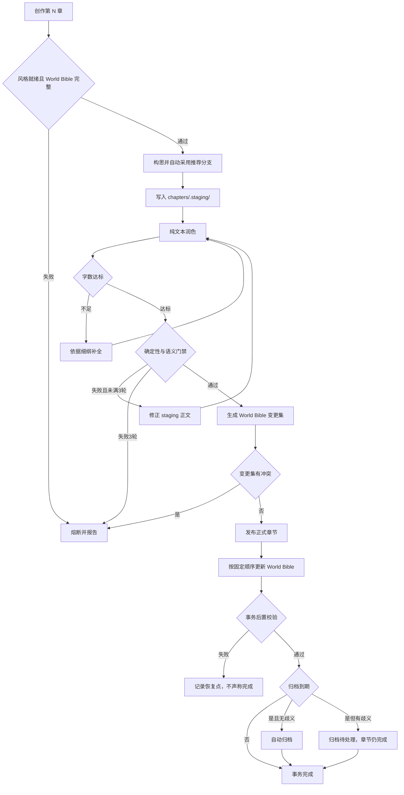

# World Bible 核心工作流

系统严格依赖 `world/outline.md`，默认以一次 `创作第 N 章` 完成完整章节事务。`构思第 N 章` 只是可选的只读预演。

## 阶段边界

- **准备阶段**只写 staging 正文与事务日志，生成审计证据和 World Bible 变更集，不修改正式章节或 World Bible。
- **提交阶段**发布正式章节并回写 World Bible，完成后执行一致性与幂等校验。
- **文本润色**只改变正文表达，不负责字数判定、世界观审计、状态回写或归档。
- **条件归档**由 `创作第 N 章` 一次性授权，仅在到期且范围无歧义时执行。

## 周期门禁

完整原创性审计在初始化大纲后、每 10 章、卷结束或主线/金手指/力量体系重大调整时执行。周期审计存在阻断项时，不得开始下一创作周期。

失败后不得自动覆盖或整文件回滚用户原有差异，必须报告事务 ID、最后成功步骤、已修改文件和恢复点。
